# توثيق المشاريع

يحتوي هذا المستودع على مشروعين منفصلين: تطبيق ويب لتحليل اللياقة البدنية، وتطبيق جوال لمتابعة النشاط الصحي.

---

## 1. لوحة تحكم تحليل النشاط البدني (تطبيق ويب)

### نظرة عامة

هذا المشروع هو تطبيق ويب متقدم مبني باستخدام **Angular**، وهو مصمم ليكون أداة شاملة لتحليل وتتبع بيانات اللياقة البدنية للمستخدمين. يوفر التطبيق لوحة تحكم غنية بالبيانات، ورسوم بيانية تفاعلية، وتحليلات عميقة تساعد المستخدمين على فهم نشاطهم البدني، وتحديد الأهداف، ومراقبة تقدمهم بمرور الوقت. الواجهة مصممة بالكامل لدعم اللغة العربية والتخطيط من اليمين إلى اليسار (RTL).

### الميزات الرئيسية

-   **نظام المصادقة (Authentication)**: نظام تسجيل دخول وخروج آمن.
-   **لوحة التحكم الرئيسية (Dashboard)**: عرض شامل للمؤشرات الرئيسية وإدارة المستخدمين.
-   **نظرة عامة على اللياقة (Fitness Overview)**: ملخص سريع للنشاط اليومي مع بطاقات تفاعلية.
-   **تحليلات اللياقة المتقدمة (Advanced Fitness Analytics)**: تحليل البيانات التاريخية، تتبع BMI، درجة اللياقة، ومقارنات مع المعايير العالمية.
-   **تصدير البيانات (Data Export)**: إمكانية تصدير التقارير إلى ملفات CSV.

### التقنيات المستخدمة

-   **الواجهة الأمامية**: Angular, TypeScript, SCSS
-   **الرسوم البيانية**: Chart.js

### لقطات من الشاشة

  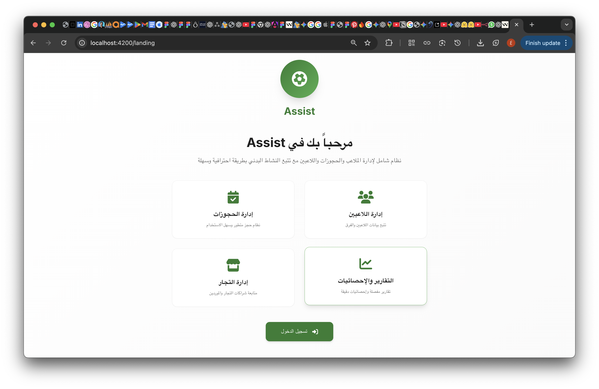
  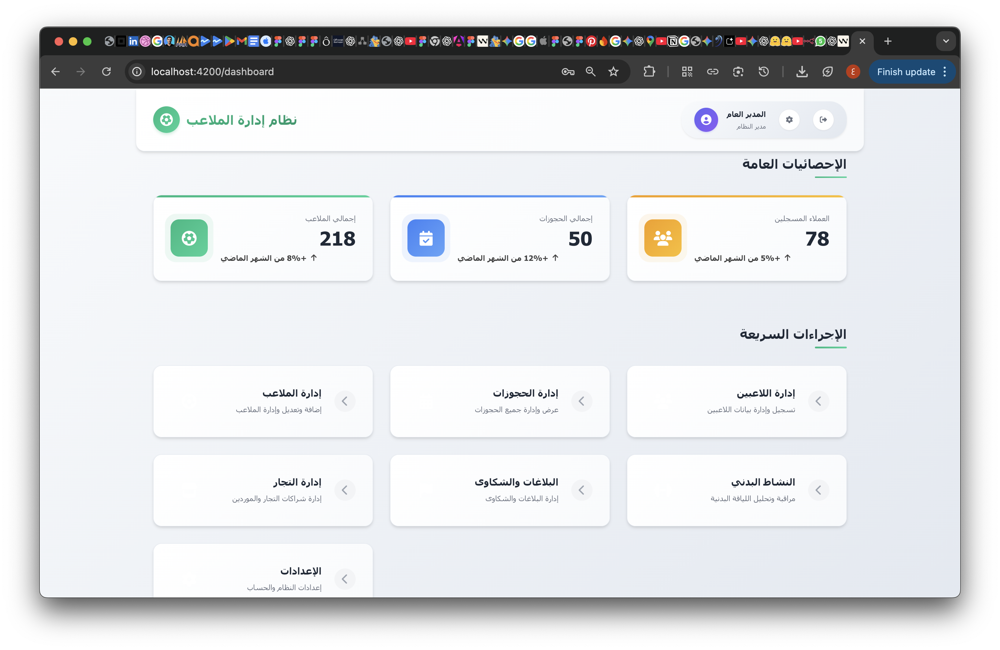

  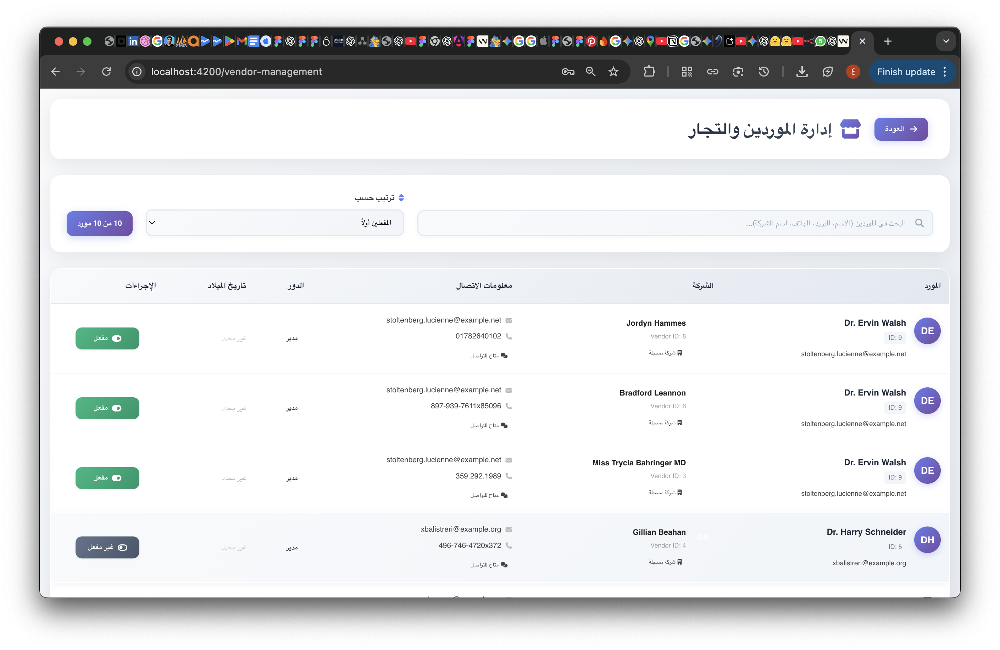
  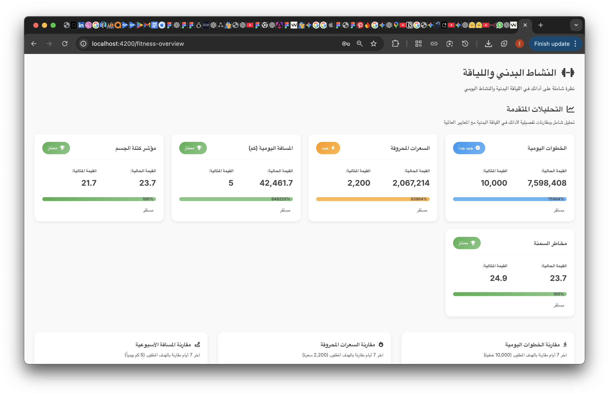
  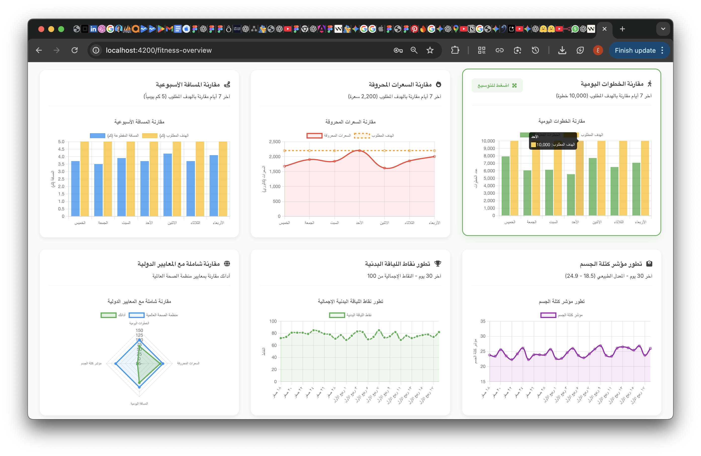

---

## 2. تطبيق Assist - رفيقك الصحي (تطبيق جوال)

  

### 🌟 نظرة عامة

Assist هو تطبيق مبتكر مصمم لمساعدتك على مراقبة وتحسين نشاطك البدني وصحتك العامة. من خلال واجهة أنيقة وبسيطة مستوحاة من تصميم Apple، يوفر التطبيق رؤى دقيقة حول حركتك اليومية، استهلاك السعرات الحرارية، والتقدم المحرز نحو أهدافك الصحية.

### ✨ الميزات الرئيسية

-   **🏃‍♂️ تتبع شامل للنشاط:** حلقات نشاط لتحفيز الحركة ومزامنة مع Google Fit و Apple Health.
-   **🤖 مساعد ذكي (Gemini):** يقدم نصائح صحية مخصصة بناءً على بيانات نشاطك.
-   **👤 ملف شخصي وإعدادات:** إدارة البيانات الصحية وتخصيص إعدادات التطبيق.

### 🎨 نظام التصميم

-   **الألوان:** أبيض، رمادي فلكي (`#1D1D1F`)، مع لمسات من الأخضر الليموني (`#E6FF2B`).
-   **الطباعة:** خط `Cairo` لتجربة قراءة عربية ممتازة.
-   **التصميم:** واجهات قائمة على البطاقات (Card-based) مع زوايا دائرية.

### 🛠️ التقنيات المستخدمة

-   **إطار العمل:** [Flutter](https://flutter.dev/)
-   **إدارة الحالة:** [GetX](https://pub.dev/packages/get)
-   **الذكاء الاصطناعي:** [Google Generative AI (Gemini)](https://pub.dev/packages/google_generative_ai)
-   **الصحة:** [Health](https://pub.dev/packages/health)

### 🖼️ لقطات شاشة

  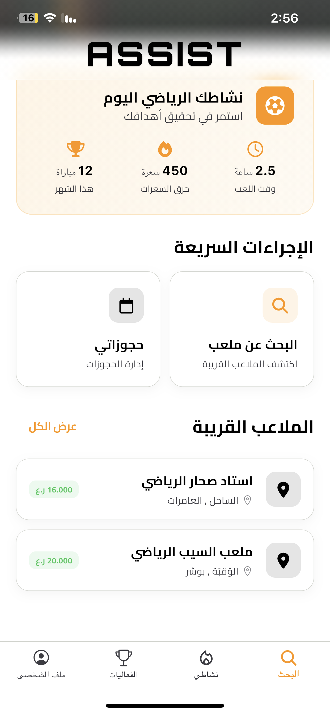
  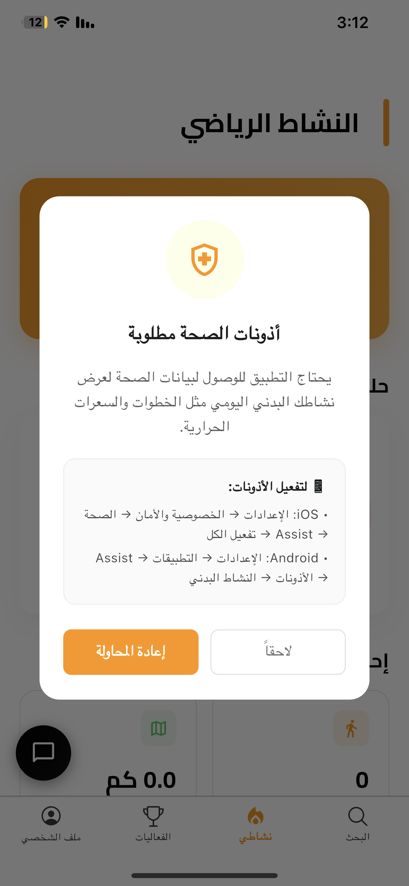
  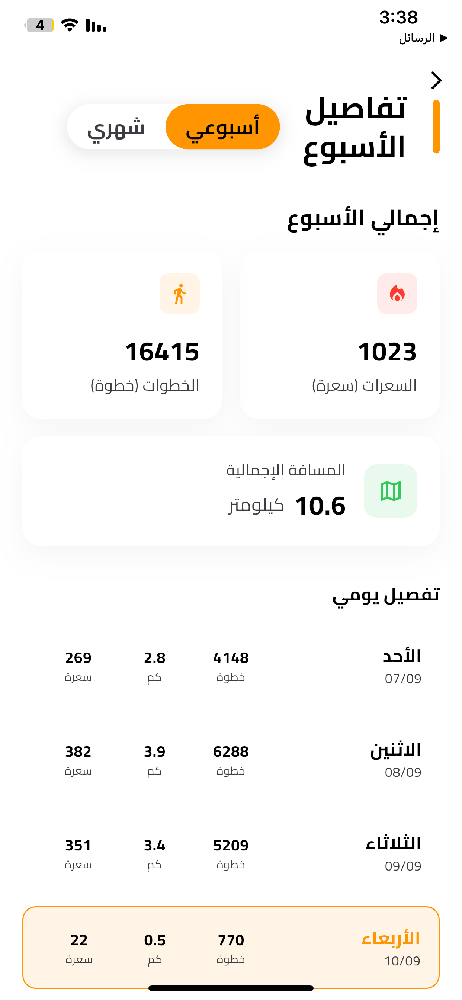
  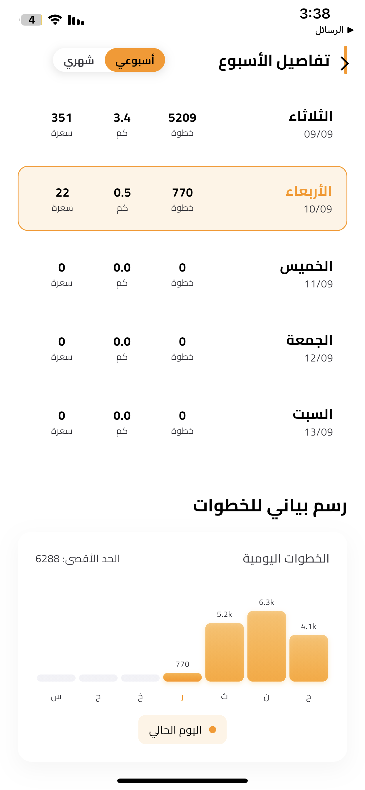

  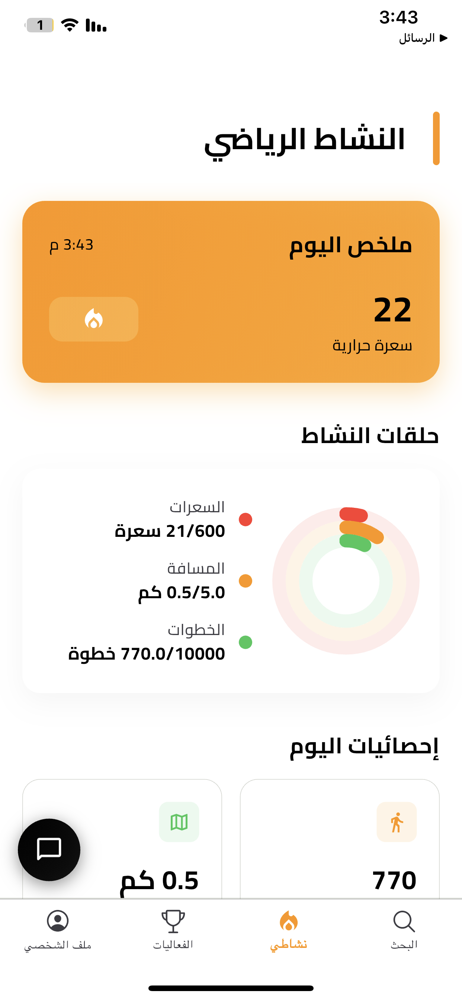
  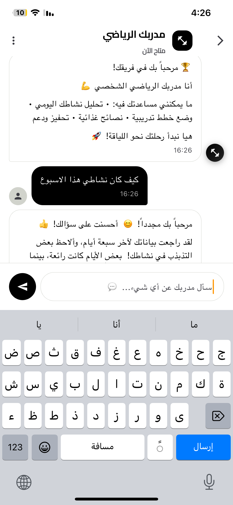
  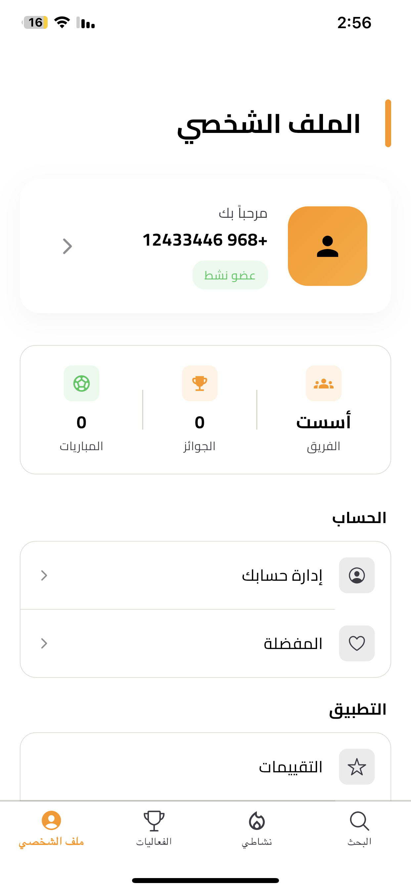
  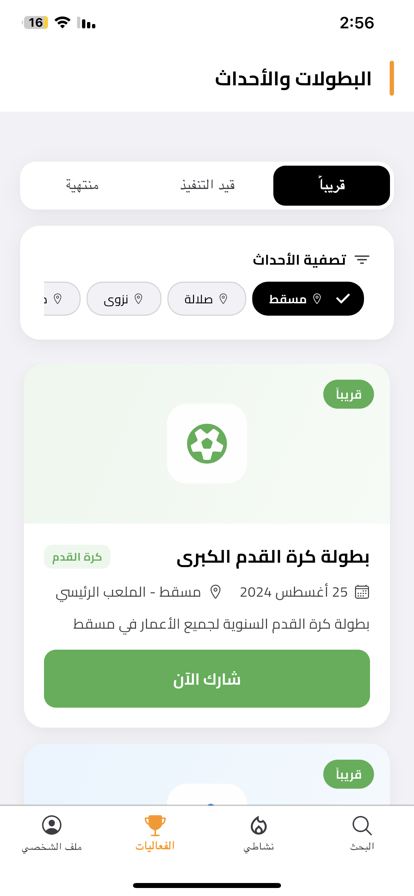

### فيديو توضيحي

  

