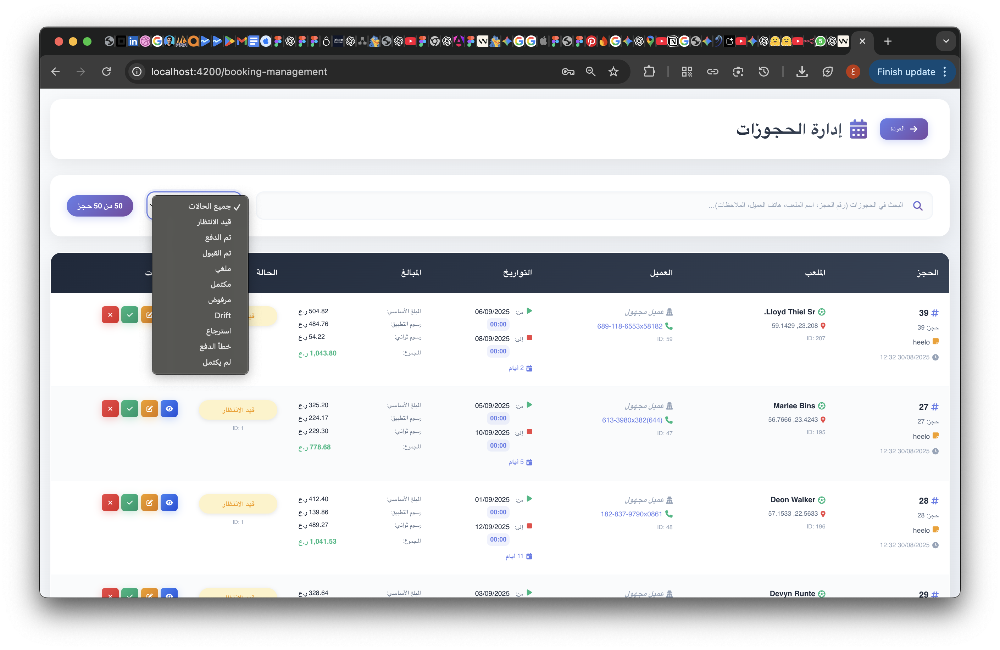
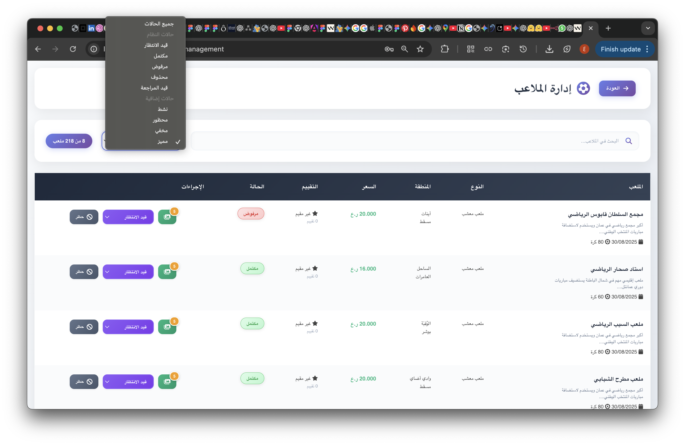
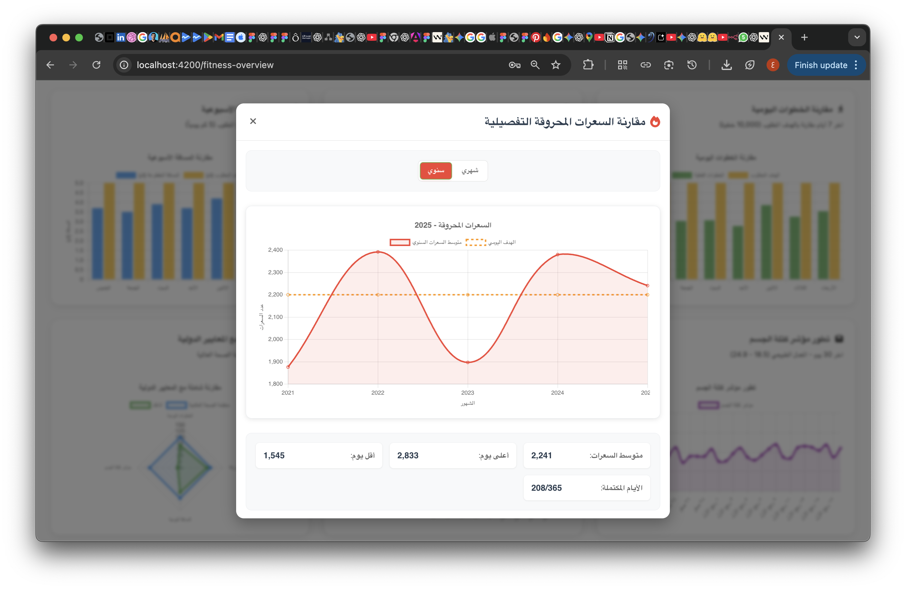
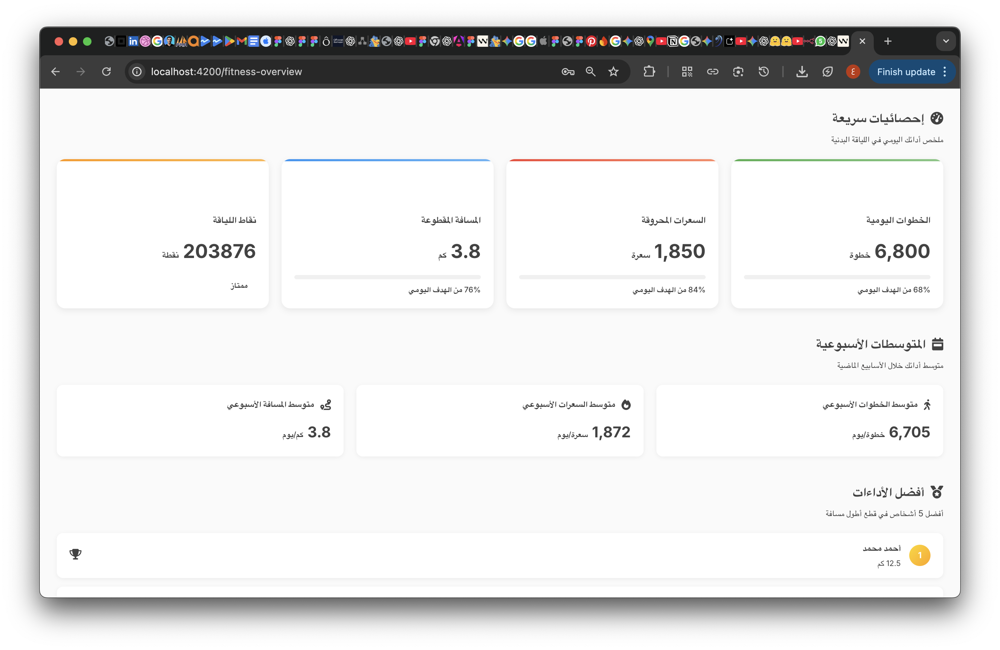

# Assist - نظام إدارة الملاعب واللياقة البدنية

## نظرة عامة

**Assist** هو تطبيق ويب شامل مبني باستخدام Angular، مصمم لتوفير حل متكامل لإدارة ملاعب كرة القدم، الحجوزات، والعملاء. بالإضافة إلى ذلك، يتضمن التطبيق وحدة متقدمة لتتبع وتحليل بيانات اللياقة البدنية، مما يمنح المشرفين أدوات قوية لمراقبة العمليات، ويزود المستخدمين برؤى تفصيلية حول نشاطهم البدني. الواجهة مصممة بالكامل لدعم اللغة العربية والتخطيط من اليمين إلى اليسار (RTL).

---

## الميزات الرئيسية

### 1. **نظام المصادقة (Authentication)**
- نظام تسجيل دخول وخروج آمن يعتمد على التوكن (Token-based).
- تخزين بيانات الجلسة بشكل آمن في المتصفح.
- حماية المسارات لضمان وصول المستخدمين المصرح لهم فقط.

### 2. **لوحة التحكم الرئيسية (Dashboard)**
- عرض شامل للمؤشرات الرئيسية مثل: إجمالي العملاء، الملاعب، والحجوزات.
- ملخص يومي لنشاط اللياقة البدنية (الخطوات، السعرات الحرارية، المسافة).
- قائمة بأفضل 5 مستخدمين أداءً من حيث المسافة المقطوعة.
- عرض آخر الحجوزات التي تمت في النظام.

### 3. **إدارة الملاعب (Stadium Management)**
- واجهة متكاملة لعرض جميع الملاعب مع خيارات للبحث والتصفية.
- التحكم في حالة الملاعب (حظر/إلغاء حظر، إخفاء/إظهار، تمييز كملعب مميز).
- إدارة حالة الملعب (قيد الانتظار، مكتمل، مرفوض، إلخ).
- نظام ترقيم الصفحات (Pagination) لتسهيل التنقل بين البيانات الكبيرة.

### 4. **إدارة العملاء والحجوزات (Customer & Booking Management)**
- أقسام مخصصة لعرض وإدارة جميع المستخدمين المسجلين والحجوزات.

### 5. **نظرة عامة على اللياقة (Fitness Overview)**
- لوحة تحكم شخصية للمستخدم لعرض ملخص سريع لنشاطه اليومي.
- بطاقات تفاعلية تعرض (الخطوات، السعرات الحرارية، المسافة) مع مقارنات بالأيام السابقة.
- رسوم بيانية تفاعلية يمكن توسيعها لعرض تحليلات مفصلة.

### 6. **تحليلات اللياقة المتقدمة (Advanced Fitness Analytics)**
- **تحليل البيانات التاريخية**: رسوم بيانية تفاعلية لمقارنة بيانات اللياقة (يوميًا، شهريًا، سنويًا).
- **تتبع تطور مؤشر كتلة الجسم (BMI)**: عرض مرئي لتغيرات مؤشر كتلة الجسم مع مرور الوقت.
- **درجة اللياقة (Fitness Score)**: نظام تقييم فريد لتحديد مستوى اللياقة البدنية للمستخدم.
- **مقارنات إقليمية ودولية**: مقارنة أداء المستخدم مع التصنيفات الإقليمية والمعايير الصحية العالمية (مثل منظمة الصحة العالمية).
- **توقع السمنة**: خوارزمية لتوقع مؤشر كتلة الجسم المستقبلي وتحديد المخاطر الصحية المحتملة.

### 7. **تصدير البيانات (Data Export)**
- إمكانية تصدير بيانات اللياقة والتقارير الأخرى إلى ملفات بصيغة CSV.

---

## لقطات من الشاشة (Screenshots)

*يرجى إنشاء مجلد باسم `screenshots` في الدليل الرئيسي للمشروع ووضع الصور التالية فيه.*

| صفحة تسجيل الدخول | لوحة التحكم الرئيسية |
| :---: | :---: |
|  |  |

| إدارة الملاعب | إدارة العملاء |
| :---: | :---: |
|  |  | |

| نظرة عامة على اللياقة | تحليلات اللياقة البدنية |
| :---: | :---: |
|  |  |  |  |


---

## التقنيات المستخدمة

- **الواجهة الأمامية**: Angular, TypeScript, SCSS
- **الرسوم البيانية**: Chart.js
- **التصميم**: تصميم متجاوب (Responsive) مع دعم كامل للغة العربية (RTL)

---

## واجهات برمجة التطبيقات (API Endpoints)

يستخدم التطبيق مجموعة من واجهات برمجة التطبيقات (APIs) لجلب البيانات ومعالجتها. نقطة النهاية الرئيسية هي:
`http://XXXXX:8001/api`

- **المصادقة**: `/admin/login`
- **بيانات لوحة التحكم**: `/dash/counts`
- **بيانات الملاعب**: `/admin/stadiums`

---

## كيفية البدء

### المتطلبات
- [Node.js](https://nodejs.org/)
- [Angular CLI](https://angular.io/cli)

### التثبيت

1. **استنسخ المستودع:**
   ```sh
   git clone <your-repository-url>
   cd <project-directory>
   ```

2. **ثبّت الاعتماديات:**
   ```sh
   npm install
   ```

### تشغيل التطبيق

1. **شغّل خادم التطوير:**
   ```sh
   ng serve
   ```

2. **افتح المتصفح:**
   انتقل إلى `http://localhost:4200/`.

